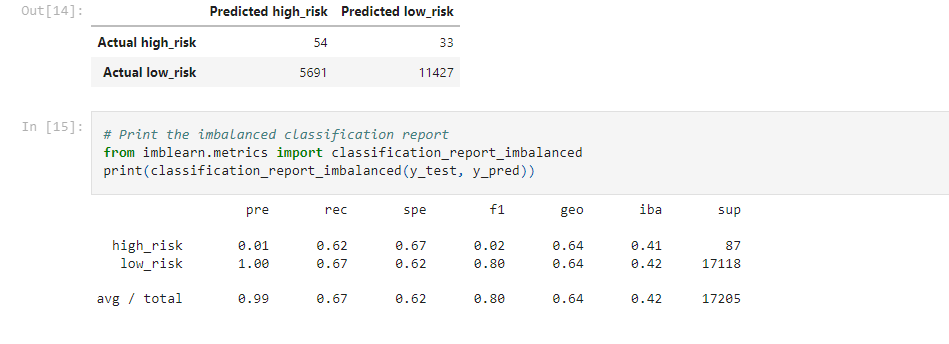
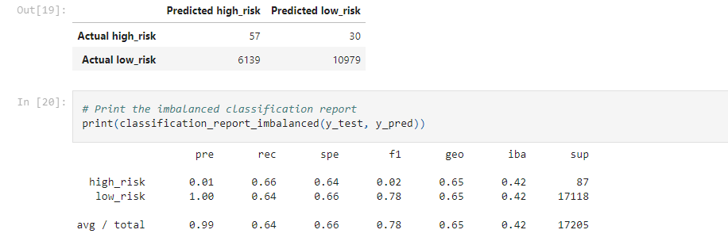
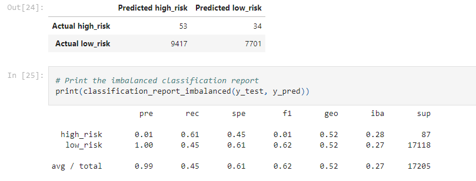
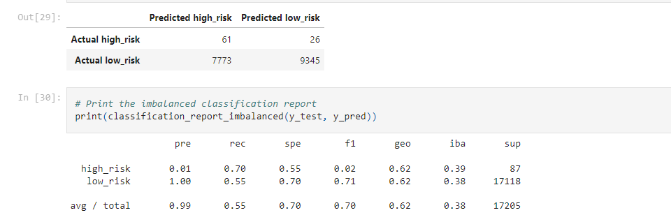
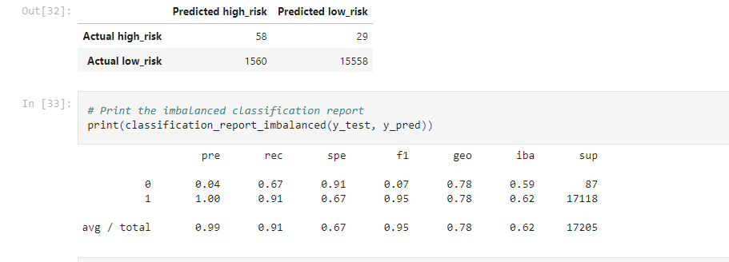
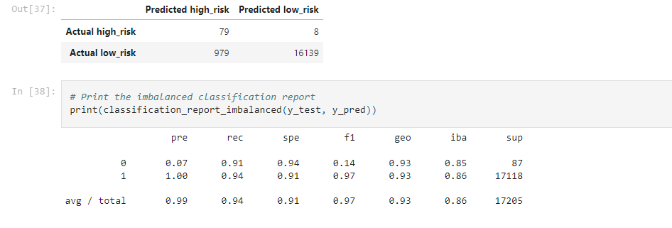

# Credit_Risk_Analysis
## Overview of Analysis
> Using the credit card credit dataset from LendingClub, a peer-to-peer lending services company, we will employ different techniques to train and evaluate models with unbalanced classes.Using the oversample model and undersample model we will compare two machine-learning results. The methods we are going to follow randomoversample and smote algorithms then ClusterCentroids for undersample algorithms. Another comparison algorithm is smoteen which used for combinational approach. End of the project we will use BalancedRandomForestClassifier and EasyEnsembleClassifier for prediction for a credit risk and try to find a best way to use it further processes.
## Results
### Random Oversampling
* 64% Accuracy
* 1% precision
* 67% Recall
* 2% F1 Score
    
### SMOTE
* 63% Accuracy
* 1% precision
* 66% recall
* 2% f1 Score  
  
### ClusterCentroids
* 53% Accuracy
* 1% Precision
* 61% Recall
* 1% F1 Score  
  
### SMOTEEN
* 63% Accuracy
* 1% Precision
* 70% Recall
* 2% F1 Score  
  
### Balanced Random Forest Classifer
* 79% Accuracy
* 4% Precision
* 67% Recall
* 7% F1 Score  
  
### Easy Ensemble Classifer
* 93% Accuracy 
* 7% Precision
* 91% Recall
* 14% F1 Score  
  
## Summary
> This 
